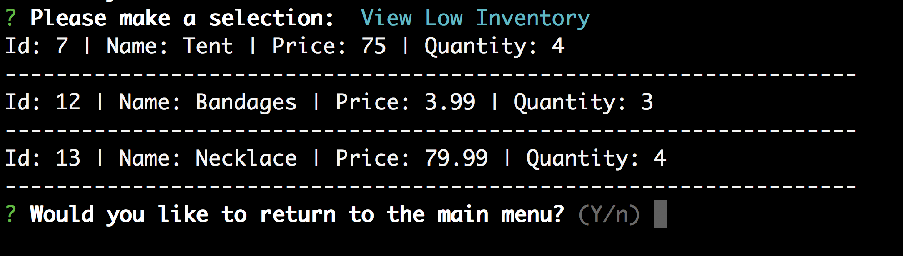
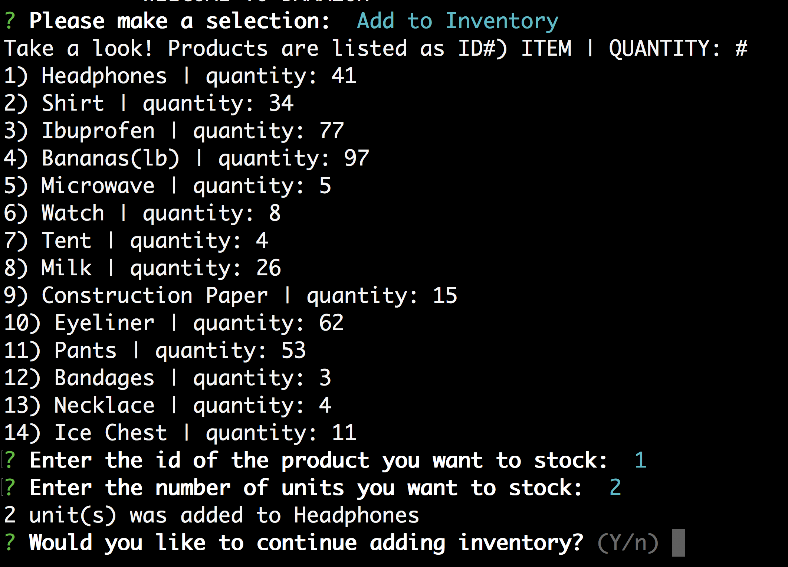
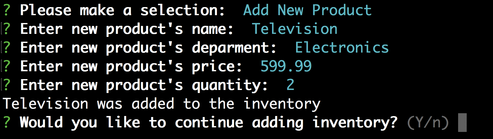

# Bamazon

## bamazonCustomer Instructions

1. Run `node bamazonCustomer.js` on command line

2. You will see the list of products. Listed as ID#) ITEM | PRICE($) 
    - Enter product's id
    - Enter number of units you would like to purchase

3. You will be asked if you want to continue shopping
    - If "yes", you will be returned to step 2
    - If "no", you will be prompted to step 4

    

4. Your total cost for the products purchased will be displayed and application will end
    - For example, we purchased 2 headphones for $15/each and 1 lb of bananas for $0.89/each. Thus, total was $30.89

    

## bamazonManager Instructions

1. Run `node bamazonManager.js` on command line

2. Select from the available options:

    

    * View Products for Sale
        - You will see the list of products

        

        - You will then be prompted to return to the main menu or terminate application

    * View Low Inventory
        - You will see the list of products with stock of less than 5 units

        

        - You will then be prompted to return to the main menu or terminate application
    
    * Add to Inventory
        - You will see the list of products for your convenience. Listed as ID#) ITEM | QUANTITY(#)
        - Select a product based on its ID
        - Enter the units you want to add
        
        

        - You then have the option to continue adding stock or to return to the main menu

    * Add New Product
        - Enter product's name, department, price, and quantity

        

        - You can continue adding products if you like, return to the main menu, or terminate the application

## Pseudocode - bamazonSupervisor

1. Create table called departments in MySQL. Details:
    - Using SQL to create table in the bamazon database

2. Modify products table to include product_sales column. Details:
    - "ALTER TABLE" command

3. Modify bamazonCustomer.js to reflect product_sales. Details:
    - In my particular code, where I calculate total cost of items purchased and UPDATE the table, I will also UPDATE product sales

4. bamazonSupervisor.js
    - Display main menu options: View Product Sales by Department and Create New Department
    - View Product Sales
        * READ information from the departments table
        * Calculate total_profit using over_head_costs and product_sales
        * Display deparments tables columns AND total_profit calculated to the user
    - Create New Department
        * Functionality will be similar to Add New Product from the bamazonManager.js
        * User will be prompted to add fields
        * Use mysql npm package to CREATE new row of information

      
