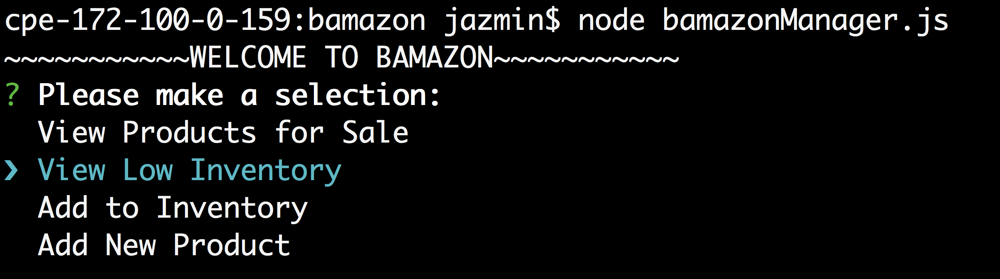
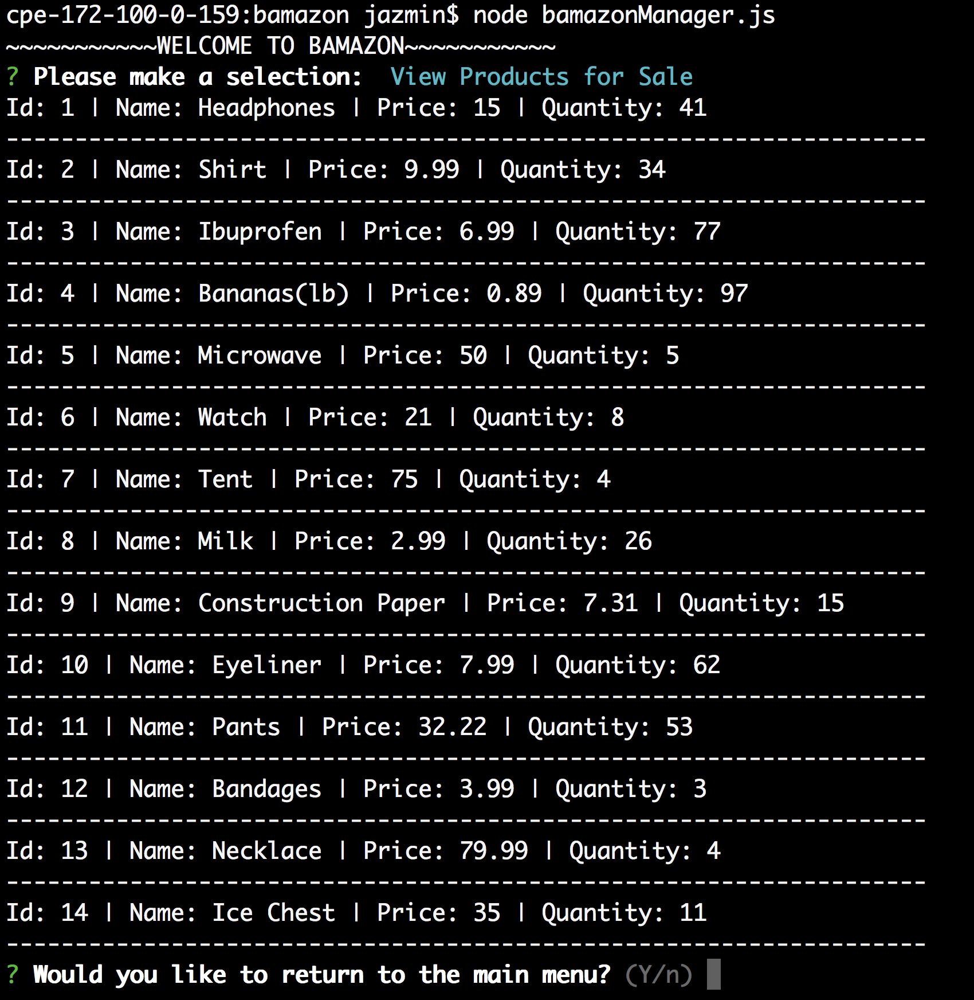

# Bamazon

## bamazonCustomer Instructions

1. Run "node bamazonCustomer.js" on command line

2. You will see the list of products. Listed as ID#) ITEM | PRICE: $$ 
    - Enter product's id
    - Enter number of units you would like to purchase

3. You will be asked if you want to continue shopping
    - If "yes", you will be returned to step 2
    - If "no", you will be prompted to step 4

4. Your total cost for the products purchased will be displayed and application will end
    - For example, we purchased 2 headphones for $15/each and 1 lb of bananas for $0.89/each. Thus, total was $30.89

## bamazonManager Instructions

1. Run "node bamazonManager.js" on command line

2. Select from the available options:

    * View Products for Sale
        - You will see the list of products
        - You will be prompted to return to the main menu or terminate application

    * View Low Inventory
        - You will see the list of products with stock of less than 5 units
        - You will be prompted to return to the main menu or terminate application

      
